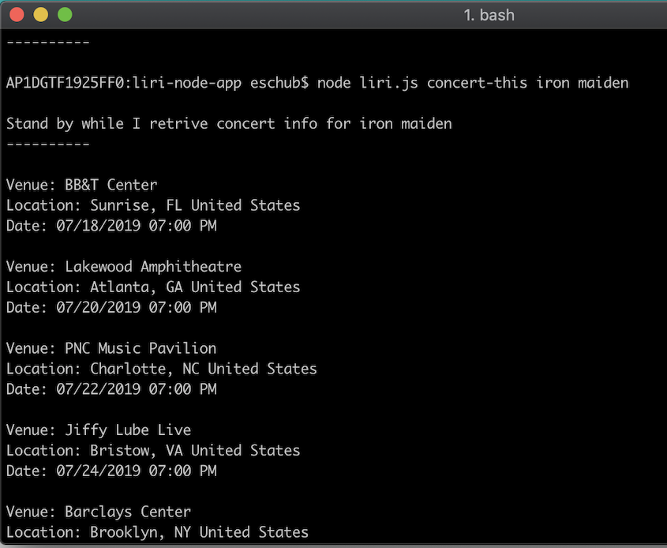
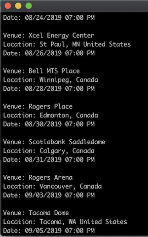

# LIRI Bot

## Table of Contents

- [What is this thing](https://github.com/bernardericschubert/liri-node-app#what-is-this-thing)
- [Application Details](https://github.com/bernardericschubert/liri-node-app#application-details)
- [In Action](https://github.com/bernardericschubert/liri-node-app#in-action)
- [Technologies](https://github.com/bernardericschubert/liri-node-app#technologies)

## What Is This Thing

LIRI is like iPhone's SIRI. However, while SIRI is a Speech Interpretation and Recognition Interface, LIRI is a Language Interpretation and Recognition Interface. LIRI is a command line interface Node.js app that takes in parameters and gives you back data after querying 3 different APIs.  Users are able to query Bands In Town for upcoming concerts, Spotify for track information, and OMDB for movie information.

## Application Details

As mentioned above, the application makes use of 3 core APIs: Bands In Town, Spotify, and OMDB.  Users enter command line arguments to retrieve information of their choosing.  The application was built using Node.js and a number of NPM packages including Axios, Spotify API, Fs, and Moment.  In addition to the APIs, the application can also use the local filesystem to query data.  This is accomplished via the Fs package - data is stored in a text file and parsed for user consumption.

## In Action

The CLI is straight-forward.

Commands | Function
---------|---------
concert-this | Utilizes the **bandsintown** API to take a band name argument from the user and return a listing of upcoming concerts
spotify-this-song | Utilizes the **spotify** API to take a song name argument from the user and return a list consisting of the artist, song name, spotify-link and album 
movie-this | Utilizes the **OMDB** API to take a movie name argument from the user and returns meta-data about that movie
do-what-it-says | Utilizes the Fs NPM package to parse a text file and run the appropriate function

**To get started, you'll need to ensure the following is installed:**
1. **Dotenv:** Dotenv is a zero-dependency module that loads environment variables from a .env file into process.env. Storing configuration in the environment separate from code is more security

     *Command Line: 'npm install dotenv'*

2. **Axios:** - Axios allows for simple API request and response

     *Command Line: 'npm install axios'*

3. **Moment:** - A lightweight JavaScript date library for parsing, validating, manipulating, and formatting dates. 

    *Command Line: 'npm install moment'*

4. **node-spotify-api:** - A simple to use library for the Spotify REST API

    *Command Line: 'npm install node-spotify-api'*

Read more about these packages [here](https://www.npmjs.com/)

### Functionality

1. Bands In Town

    *node liri.js concert-this [band name]*

    

    

    

2. Spotify

    *node liri.js spotify-this-song [song name]*

    If not song name is provided, a default is returned.  See image below.

    

    

    

3. OMDB

    *node liri.js movie-this [movie name]*

    If no movie name is provided, a default is returned.  See image below.

    

    

    

    

4. Do What It Says

    *node liri.js do-what-it-says*

    

## Technologies

- Node.js
- NPM

APIs
- Bands In Town
- Spotify
- OMDB

